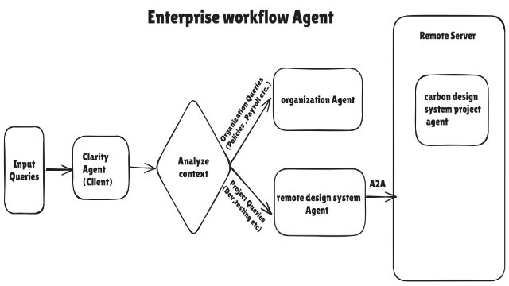

# Enterprise WorkFlow Agent - MultiAgent/A2A Demo



This project contains demo of Enterprise workflow Agent **(Clarity)** using Google ADK.

There are 3 agents involved:

1. **AI Assistant:** This is a local  agent (Clarity) where user will communicate directly.

2. **Specialized Agents:** 
  *   **Organization Agent**:
        *   Handles organizational-level queries.
        *   Provides information on HR policies, payroll, and other administrative matters by using FireCrawl MCP server.
  *   **Remote Design System Agent**:
        *   Handles project-related queries by calling design system project Agent which is hosted in external server through A2A protocol.
        *   Focuses on technical aspects such as development standards, testing frameworks, and design systems.
    
3. **Carbon Design System Agent:** This is the remote agent which helps in providing project related information using Firecrawl API.

---

## Prerequisites

- Python installed
- **Gemini API** key
- A **GCP Project** with:
  - **Billing enabled**
  - **Vertex AI APIs** enabled
- **FireCrawl** account and its API key (Third party tools supported by google ADK)
- [Google Application Credential Set up in Environtment variable](https://docs.cloud.google.com/docs/authentication/application-default-credentials)
---

## Setup environment

### 1. Clone the Repository
```bash
git clone <repo_url>
cd enterprise-workflow-agent-A2A
```

### 2. Install python packages

```bash
python -m pip install -r requirements.txt
```

## Run first remote agent (carbon_design_system_agent)

### 1. Setup env file

Copy env file and update the provided variables in each

```bash
cd enterprise-workflow-agent-A2A/remote_agents
cp .env.example .env
```

### 2. Run Remote Agent

Expose the agent using uvicorn on port 8001.
```bash
cd enterprise-workflow-agent-A2A/remote_agents
uvicorn carbon_design_system_agent.agent:a2a_app --host localhost --port 8001
```

### 2. Verify Agent Card

Open URL "http://localhost:8001/.well-known/agent-card.json" in the browser.


## Run Local Agent

Now, Open another terminal.

### 1. Setup env file

Copy env file and update the provided variables in each

```bash
cd enterprise-workflow-agent-A2A/client_agent/
cp .env.example .env
```

### 2. Run Client Agent

Run it using adk web.
```bash
adk web
```

### 3. Access the agent

Open URL "http://localhost:8000" in the browser.
